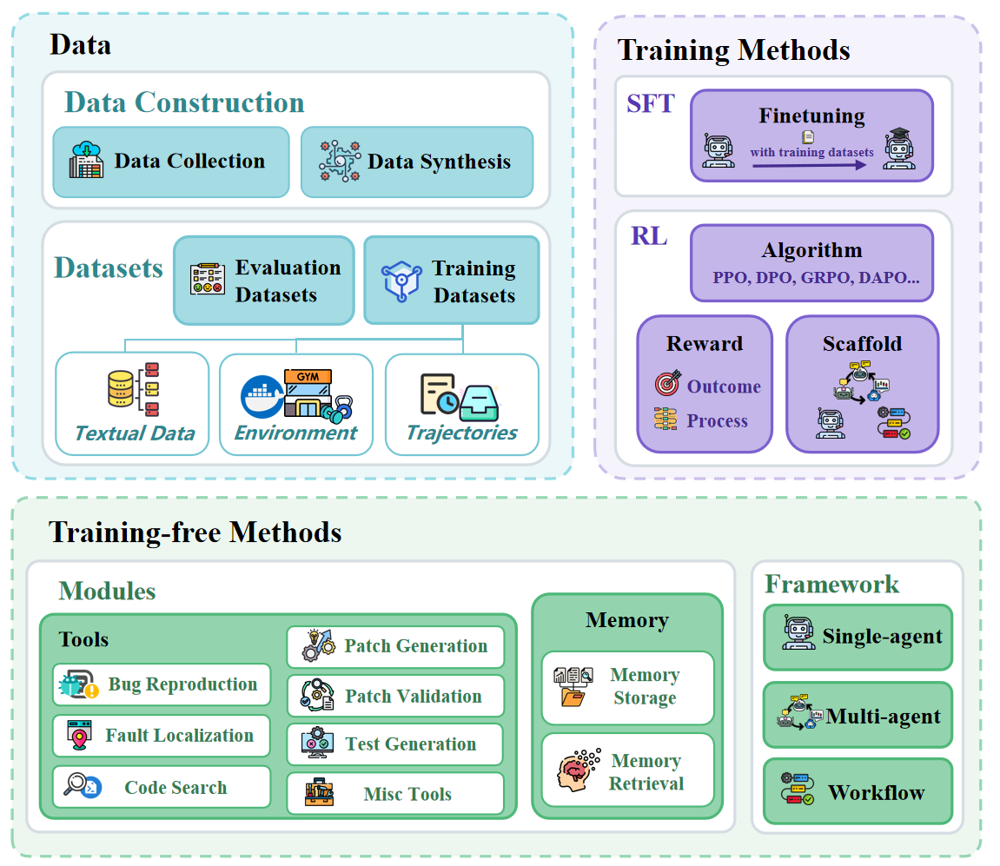

# ✨ Awesome Issue Resolution

    <h1 class="hero-title">✨ Awesome Issue Resolution</h1>
    
Advances and Frontiers of LLM-based Issue Resolution in Software Engineering A Comprehensive Survey

    
    <!-- Dynamic Badges -->
    

        
        
        
        
        
        
        
        
        
    

    
    <!-- Interactive Exploration Badges -->
    

        
        
        
    

    
    

        
    

---

## 📖 Abstract

Based on a systematic review of 178 papers and online resources, this survey establishes a holistic theoretical framework for Issue Resolution in software engineering. We examine how Large Language Models (LLMs) are transforming the automation of GitHub issue resolution. Beyond the theoretical analysis, we have curated a comprehensive collection of datasets and model training resources, which are continuously synchronized with our [GitHub repository](https://github.com/DeepSoftwareAnalytics/Awesome-Issue-Resolution) and project documentation website. 

**🔍 Explore This Survey:**

- 📊 **[Data](#data)**: Evaluation and training datasets, data collection and synthesis methods
- 🛠️ **[Methods](#methods)**: Training-free (agent/workflow) and training-based (SFT/RL) approaches  
- 🔍 **[Analysis](#analysis)**: Insights into both data characteristics and method performance
- 📋 **[Tables & Resources](tables/)**: Comprehensive statistical tables and resources
- 📄 **[Full Paper](paper/)**: Read the complete survey paper

<figure class="framework-figure">
    
    <figcaption>Figure: Overview of the Issue Resolution framework.</figcaption>
</figure>

---

## 📊 Data

This section covers the datasets used for evaluation and training, as well as methods for data construction.

### Evaluation Datasets

<!-- START PAPERS:evaluation_datasets -->
* **SWE-bench Lite**: SWE-bench: Can Language Models Resolve Real-world Github Issues? (2024)
* **SWE-bench Verified**: Introducing SWE-bench Verified | OpenAI (2024)
* **SWE-bench-java**: SWE-bench-java: A GitHub Issue Resolving Benchmark for Java (2024) {: target="_blank" }
* **Visual SWE-bench**: CodeV: Issue Resolving with Visual Data (2025) {: target="_blank" } {: target="_blank" }
* **SWE-Lancer**: SWE-Lancer: Can Frontier LLMs Earn $1 Million from Real-World
                  Freelance Software Engineering? (2025)
* **FEA-Bench**: FEA-Bench: A Benchmark for Evaluating Repository-Level Code Generation
                  for Feature Implementation (2025) {: target="_blank" }
* **Multi-SWE-bench**: Multi-SWE-bench: A Multilingual Benchmark for Issue Resolving (2025) {: target="_blank" }
* **SWE-PolyBench**: SWE-PolyBench: A multi-language benchmark for repository level evaluation of coding agents (2025) {: target="_blank" }
* **SWE-bench Multilingual**: SWE-smith: Scaling Data for Software Engineering Agents (2025) {: target="_blank" }
* **SwingArena**: SwingArena: Competitive Programming Arena for Long-context GitHub Issue Solving (2025) {: target="_blank" }
* **SWE-bench Multimodal**: SWE-bench Multimodal: Do AI Systems Generalize to Visual Software Domains? (2025) {: target="_blank" }
* **OmniGIRL**: Omnigirl: A multilingual and multimodal benchmark for github issue resolution (2025)
* **SWE-bench-Live**: SWE-bench Goes Live! (2025) {: target="_blank" }
* **SWE-Factory**: SWE-Factory: Your Automated Factory for Issue Resolution Training Data and Evaluation Benchmarks (2025) {: target="_blank" }
* **SWE-MERA**: SWE-MERA: A Dynamic Benchmark for Agenticly Evaluating Large Language Models on Software Engineering Tasks (2025) {: target="_blank" }
* **SWE-Perf**: SWE-Perf: Can Language Models Optimize Code Performance on Real-World Repositories? (2025) {: target="_blank" }
* **SWE-Bench Pro**: SWE-Bench Pro: Can AI Agents Solve Long-Horizon Software Engineering Tasks? (2025) {: target="_blank" }
* **SWE-InfraBench**: SWE-InfraBench: Evaluating Language Models on Cloud Infrastructure Code (2025) {: target="_blank" }
* **SWE-Sharp-Bench**: SWE-Sharp-Bench: A Reproducible Benchmark for C# Software Engineering Tasks (2025) {: target="_blank" }
* **SWE-fficiency**: SWE-fficiency: Can Language Models Optimize Real-World Repositories on Real Workloads? (2025) {: target="_blank" }
* **SWE-Compass**: SWE-Compass: Towards Unified Evaluation of Agentic Coding Abilities for Large Language Models (2025) {: target="_blank" }
* **SWE-EVO**: SWE-EVO: Benchmarking Coding Agents in Long-Horizon Software Evolution Scenarios (2025) {: target="_blank" }
<!-- END PAPERS:evaluation_datasets -->

### Training Datasets

<!-- START PAPERS:training_datasets -->
* **SWE-bench-extra**: SWE-bench: Can Language Models Resolve Real-world Github Issues? (2024)
* **Multi-SWE-RL**: Multi-SWE-bench: A Multilingual Benchmark for Issue Resolving (2025) {: target="_blank" }
* **R2E-Gym**: R2E-Gym: Procedural Environment Generation and Hybrid Verifiers for Scaling Open-Weights SWE Agents (2025) {: target="_blank" }
* **SWE-Synth**: SWE-Synth: Synthesizing Verifiable Bug-Fix Data to Enable Large Language Models in Resolving Real-World Bugs (2025) {: target="_blank" }
* **LocAgent**: OrcaLoca: An LLM Agent Framework for Software Issue Localization (2025) {: target="_blank" }
* **SWE-Smith**: SWE-smith: Scaling Data for Software Engineering Agents (2025) {: target="_blank" }
* **SWE-Fixer**: SWE-Fixer: Training Open-Source LLMs for Effective and Efficient GitHub Issue Resolution
* **SWELoc**: SweRank: Software Issue Localization with Code Ranking (2025) {: target="_blank" }
* **SWE-Gym**: Training Software Engineering Agents and Verifiers with SWE-Gym
* **SWE-Flow**: Synthesizing Software Engineering Data in a Test-Driven Manner (2025) {: target="_blank" }
* **SWE-Factory**: SWE-Factory: Your Automated Factory for Issue Resolution Training Data and Evaluation Benchmarks (2025) {: target="_blank" }
* **Skywork-SWE**: Skywork-SWE: Unveiling Data Scaling Laws for Software Engineering in LLMs (2025) {: target="_blank" }
* **RepoForge**: RepoForge: Training a SOTA Fast-thinking SWE Agent with an End-to-End Data Curation Pipeline Synergizing SFT and RL at Scale (2025) {: target="_blank" }
* **SWE-Mirror**: SWE-Mirror: Scaling Issue-Resolving Datasets by Mirroring Issues Across Repositories (2025) {: target="_blank" }
* **SWE-Lego**: SWE-Lego: Pushing the Limits of Supervised Fine-tuning for Software Issue Resolving (2026) {: target="_blank" }
<!-- END PAPERS:training_datasets -->

### Data Collection

<!-- START PAPERS:data_collection -->
* **SWE-rebench**: SWE-rebench: An Automated Pipeline for Task Collection and Decontaminated Evaluation of Software Engineering Agents (2025) {: target="_blank" }
* **RepoLaunch**: SWE-bench Goes Live! (2025) {: target="_blank" }
* **SWE-Factory**: SWE-Factory: Your Automated Factory for Issue Resolution Training Data and Evaluation Benchmarks (2025) {: target="_blank" }
* **SWE-MERA**: SWE-MERA: A Dynamic Benchmark for Agenticly Evaluating Large Language Models on Software Engineering Tasks (2025) {: target="_blank" }
* **RepoForge**: RepoForge: Training a SOTA Fast-thinking SWE Agent with an End-to-End Data Curation Pipeline Synergizing SFT and RL at Scale (2025) {: target="_blank" }
* **Multi-Docker-Eval**: Multi-Docker-Eval: A `Shovel of the Gold Rush' Benchmark on Automatic Environment Building for Software Engineering (2025) {: target="_blank" }
<!-- END PAPERS:data_collection -->

### Data Synthesis

<!-- START PAPERS:data_synthesis -->
* **Learn-by-interact**: Learn-by-interact: A Data-Centric Framework For Self-Adaptive Agents in Realistic Environments (2025) {: target="_blank" }
* **R2E-Gym**: R2E-Gym: Procedural Environment Generation and Hybrid Verifiers for Scaling Open-Weights SWE Agents (2025) {: target="_blank" }
* **SWE-Synth**: SWE-Synth: Synthesizing Verifiable Bug-Fix Data to Enable Large Language Models in Resolving Real-World Bugs (2025) {: target="_blank" }
* **SWE-smith**: SWE-smith: Scaling Data for Software Engineering Agents (2025) {: target="_blank" }
* **SWE-Flow**: Synthesizing Software Engineering Data in a Test-Driven Manner (2025) {: target="_blank" }
* **SWE-Mirror**: SWE-Mirror: Scaling Issue-Resolving Datasets by Mirroring Issues Across Repositories (2025) {: target="_blank" }
<!-- END PAPERS:data_synthesis -->

---

## 🛠️ Methods

This section covers both training-free and training-based methods for issue resolution.

### 🧑‍💻 Training-free Methods

#### Single-Agent

<!-- START PAPERS:single_agent -->
* **SWE-agent**: Swe-agent: Agent-computer interfaces enable automated software engineering (2024)
* **Aider** (2026) {: target="_blank" }
* **Devin**: SWE-bench technical report (2025) {: target="_blank" }
* **PatchPilot**: PatchPilot: A Cost-Efficient Software Engineering Agent with Early Attempts on Formal Verification (2025) {: target="_blank" }
* **LCLM**: Putting It All into Context: Simplifying Agents with LCLMs (2025) {: target="_blank" }
* **DGM**: Darwin Godel Machine: Open-Ended Evolution of Self-Improving Agents (2025) {: target="_blank" }
* **Trae Agent**: Trae Agent: An LLM-based Agent for Software Engineering with Test-time Scaling (2025) {: target="_blank" }
* **Live-SWE-agent**: SE-Agent: Self-Evolution Trajectory Optimization in Multi-Step Reasoning with LLM-Based Agents (2025) {: target="_blank" }
* **Lita**: Lita: Light Agent Uncovers the Agentic Coding Capabilities of LLMs (2025) {: target="_blank" }
* **TOM-SWE**: TOM-SWE: User Mental Modeling For Software Engineering Agents (2025) {: target="_blank" }
* **Confucius Code Agent**: Confucius Code Agent: Scalable Agent Scaffolding for Real-World Codebases (2025) {: target="_blank" }
<!-- END PAPERS:single_agent -->

#### Multi-Agent

<!-- START PAPERS:multi_agent -->
* **MAGIS**: MAGIS: LLM-Based Multi-Agent Framework for GitHub Issue Resolution (2024) {: target="_blank" }
* **AutoCodeRover**: AutoCodeRover: Autonomous Program Improvement (2024) {: target="_blank" }
* **CodeR**: CodeR: Issue Resolving with Multi-Agent and Task Graphs (2024) {: target="_blank" }
* **OpenHands**: OpenHands: An Open Platform for AI Software Developers as Generalist Agents (2025) {: target="_blank" }
* **AgentScope**: SWE-Bench - AgentScope (2025) {: target="_blank" }
* **OrcaLora**: OrcaLoca: An LLM Agent Framework for Software Issue Localization (2025) {: target="_blank" }
* **DEI**: Diversity Empowers Intelligence: Integrating Expertise of Software Engineering Agents (2025) {: target="_blank" }
* **MarsCode Agent**: MarsCode Agent: AI-native Automated Bug Fixing (2024) {: target="_blank" }
* **Lingxi**: Lingxi/docs/Lingxi Technical Report 2505.pdf at master · lingxi-agent/Lingxi (2026) {: target="_blank" }
* **Devlo**: Achieving SOTA on SWE-bench (2026) {: target="_blank" }
* **Refact.ai Agent**: AI Coding Agent for Software Development - Refact.ai (2025) {: target="_blank" }
* **HyperAgent**: HyperAgent: Generalist Software Engineering Agents to Solve Coding Tasks at Scale (2024) {: target="_blank" }
* **SWE-Search**: SWE-Search: Enhancing Software Agents with Monte Carlo Tree Search and Iterative Refinement (2025) {: target="_blank" }
* **CodeCoR**: CodeCoR: An LLM-Based Self-Reflective Multi-Agent Framework for Code Generation (2025) {: target="_blank" }
* **Agent KB**: Agent KB: Leveraging Cross-Domain Experience for Agentic Problem Solving (2025) {: target="_blank" }
* **SWE-Debate**: SWE-Debate: Competitive Multi-Agent Debate for Software Issue Resolution (2026)
* **SWE-Exp**: SWE-Exp: Experience-Driven Software Issue Resolution (2025) {: target="_blank" }
* **Meta-RAG**: Meta-RAG on Large Codebases Using Code Summarization (2025) {: target="_blank" }
<!-- END PAPERS:multi_agent -->

#### Workflow

<!-- START PAPERS:workflow -->
* **Agentless**: Demystifying LLM-Based Software Engineering Agents (2025) {: target="_blank" }
* **Conversational Pipeline**: Exploring the Potential of Conversational Test Suite Based Program Repair on SWE-bench (2024) {: target="_blank" }
* **SynFix**: SynFix: Dependency-Aware Program Repair via RelationGraph Analysis (2025) {: target="_blank" } {: target="_blank" }
* **CodeV**: CodeV: Issue Resolving with Visual Data (2025) {: target="_blank" } {: target="_blank" }
* **GUIRepair**: Seeing is Fixing: Cross-Modal Reasoning with Multimodal LLMs for Visual Software Issue Fixing (2025)
<!-- END PAPERS:workflow -->

#### Tool

<!-- START PAPERS:tool -->
* **MAGIS**: MAGIS: LLM-Based Multi-Agent Framework for GitHub Issue Resolution (2024) {: target="_blank" }
* **AutoCodeRover**: AutoCodeRover: Autonomous Program Improvement (2024) {: target="_blank" }
* **SWE-agent**: Swe-agent: Agent-computer interfaces enable automated software engineering (2024)
* **Alibaba LingmaAgent**: Alibaba LingmaAgent: Improving Automated Issue Resolution via Comprehensive Repository Exploration (2025) {: target="_blank" }
* **OpenHands**: OpenHands: An Open Platform for AI Software Developers as Generalist Agents (2025) {: target="_blank" }
* **SpecRover**: SpecRover: Code Intent Extraction via LLMs (2025)
* **MarsCode Agent**: MarsCode Agent: AI-native Automated Bug Fixing (2024) {: target="_blank" }
* **RepoGraph**: RepoGraph: Enhancing AI Software Engineering with Repository-level Code Graph
* **SuperCoder2.0**: SuperCoder2.0: Technical Report on Exploring the feasibility of LLMs as Autonomous Programmer (2024) {: target="_blank" }
* **EvoCoder**: LLMs as Continuous Learners: Improving the Reproduction of Defective Code in Software Issues (2024) {: target="_blank" }
* **AEGIS**: AEGIS: An Agent-based Framework for General Bug Reproduction from Issue Descriptions (2025)
* **CoRNStack**: CoRNStack: High-Quality Contrastive Data for Better Code Retrieval and Reranking (2025) {: target="_blank" }
* **OrcaLoca**: OrcaLoca: An LLM Agent Framework for Software Issue Localization (2025) {: target="_blank" }
* **DARS**: DARS: Dynamic Action Re-Sampling to Enhance Coding Agent Performance by Adaptive Tree Traversal (2025) {: target="_blank" }
* **Otter**: Otter: Generating Tests from Issues to Validate SWE Patches (2025) {: target="_blank" }
* **Quadropic Insiders**: Quadropic Insiders : Syntheo Tops Swelite Feb (2025) {: target="_blank" }
* **Issue2Test**: Issue2Test: Generating Reproducing Test Cases from Issue Reports (2025) {: target="_blank" }
* **KGCompass**: Enhancing repository-level software repair via repository-aware knowledge graphs (2025) {: target="_blank" }
* **CoSIL**: Issue Localization via LLM-Driven Iterative Code Graph Searching (2025)
* **InfantAgent-Next**: InfantAgent-Next: A Multimodal Generalist Agent for Automated Computer Interaction (2025) {: target="_blank" }
* **Co-PatcheR**: Co-PatcheR: Collaborative Software Patching with Component(s)-specific Small Reasoning Models (2025) {: target="_blank" }
* **SWERank**: SweRank: Software Issue Localization with Code Ranking (2025) {: target="_blank" }
* **Nemotron-CORTEXA**: Nemotron-CORTEXA: Enhancing LLM Agents for Software Engineering Tasks via Improved Localization and Solution Diversity (2025) {: target="_blank" }
* **LCLM**: Putting It All into Context: Simplifying Agents with LCLMs (2025) {: target="_blank" }
* **SACL**: SACL: Understanding and Combating Textual Bias in Code Retrieval with Semantic-Augmented Reranking and Localization (2025) {: target="_blank" }
* **SWE-Debate**: SWE-Debate: Competitive Multi-Agent Debate for Software Issue Resolution (2026)
* **OpenHands-Versa**: Coding Agents with Multimodal Browsing are Generalist Problem Solvers
* **SemAgent**: SemAgent: A Semantics Aware Program Repair Agent (2025) {: target="_blank" }
* **Repeton**: Repeton: Structured Bug Repair with ReAct-Guided Patch-and-Test Cycles (2025) {: target="_blank" }
* **cAST**: cAST: Enhancing Code Retrieval-Augmented Generation with Structural Chunking via Abstract Syntax Tree (2025) {: target="_blank" }
* **Prometheus**: Prometheus: Unified Knowledge Graphs for Issue Resolution in Multilingual Codebases (2025) {: target="_blank" }
* **Git Context Controller**: Git Context Controller: Manage the Context of LLM-based Agents like Git (2025) {: target="_blank" }
* **Trae Agent**: Trae Agent: An LLM-based Agent for Software Engineering with Test-time Scaling (2025) {: target="_blank" }
* **BugPilot**: BugPilot: Complex Bug Generation for Efficient Learning of SWE Skills (2025) {: target="_blank" }
* **TestPrune**: When Old Meets New: Evaluating the Impact of Regression Tests on SWE Issue Resolution (2025) {: target="_blank" }
* **Meta-RAG**: Meta-RAG on Large Codebases Using Code Summarization (2025) {: target="_blank" }
* **InfCode**: InfCode: Adversarial Iterative Refinement of Tests and Patches for Reliable Software Issue Resolution (2025) {: target="_blank" }
* **GraphLocator**: GraphLocator: Graph-guided Causal Reasoning for Issue Localization (2025) {: target="_blank" }
* **SWE-Tester**: SWE-Tester: Training Open-Source LLMs for Issue Reproduction in Real-World Repositories (2026) {: target="_blank" }
<!-- END PAPERS:tool -->

#### Memory

<!-- START PAPERS:memory -->
* **Infant Agent**: Infant Agent: A Tool-Integrated, Logic-Driven Agent with Cost-Effective API Usage (2024) {: target="_blank" }
* **EvoCoder**: LLMs as Continuous Learners: Improving the Reproduction of Defective Code in Software Issues (2024) {: target="_blank" }
* **Learn-by-interact**: Learn-by-interact: A Data-Centric Framework For Self-Adaptive Agents in Realistic Environments (2025) {: target="_blank" }
* **DGM**: Darwin Godel Machine: Open-Ended Evolution of Self-Improving Agents (2025) {: target="_blank" }
* **ExpeRepair**: EXPEREPAIR: Dual-Memory Enhanced LLM-based Repository-Level Program Repair (2025) {: target="_blank" }
* **Agent KB**: Agent KB: Leveraging Cross-Domain Experience for Agentic Problem Solving (2025) {: target="_blank" }
* **SWE-Exp**: SWE-Exp: Experience-Driven Software Issue Resolution (2025) {: target="_blank" }
* **RepoMem**: Improving Code Localization with Repository Memory (2025) {: target="_blank" }
* **AgentDiet**: Improving the Efficiency of LLM Agent Systems through Trajectory Reduction (2025) {: target="_blank" }
* **ReasoningBank**: ReasoningBank: Scaling Agent Self-Evolving with Reasoning Memory (2025) {: target="_blank" }
* **MemGovern**: MemGovern: Enhancing Code Agents through Learning from Governed Human Experiences (2026) {: target="_blank" }
* **MemGovern**: MemGovern: Enhancing Code Agents through Learning from Governed Human Experiences (2026) {: target="_blank" } {: target="_blank" }
<!-- END PAPERS:memory -->

#### Inference-time Scaling

<!-- START PAPERS:inference_scaling -->
* **SWE-Search**: SWE-Search: Enhancing Software Agents with Monte Carlo Tree Search and Iterative Refinement (2025) {: target="_blank" }
* **ReasoningBank**: CodeMonkeys: Scaling Test-Time Compute for Software Engineering (2025) {: target="_blank" }
* **SWE-PRM**: When Agents go Astray: Course-Correcting SWE Agents with PRMs (2025) {: target="_blank" }
* **SIADAFIX**: SIADAFIX: issue description response for adaptive program repair (2025) {: target="_blank" }
* **Agentic Rubrics**: Agentic Rubrics as Contextual Verifiers for SWE Agents (2026) {: target="_blank" } {: target="_blank" }
<!-- END PAPERS:inference_scaling -->

### 🧠 Training-based Methods

#### SFT-based Methods

<!-- START PAPERS:sft -->
* **Lingma SWE-GPT**: SWE-GPT: A Process-Centric Language Model for Automated Software Improvement (2025)
* **ReSAT**: Repository Structure-Aware Training Makes SLMs Better Issue Resolver (2024) {: target="_blank" }
* **Scaling data collection**: Scaling Data Collection for Training SWE Agents (2024) {: target="_blank" }
* **CodeXEmbed**: CodeXEmbed: A Generalist Embedding Model Family for Multilingual and Multi-task Code Retrieval (2025) {: target="_blank" }
* **SWE-Gym**: Training Software Engineering Agents and Verifiers with SWE-Gym
* **Thinking Longer**: Thinking Longer, Not Larger: Enhancing Software Engineering Agents via Scaling Test-Time Compute (2025) {: target="_blank" }
* **Search for training**: Guided Search Strategies in Non-Serializable Environments with Applications to Software Engineering Agents (2025) {: target="_blank" }
* **Co-PatcheR**: Co-PatcheR: Collaborative Software Patching with Component(s)-specific Small Reasoning Models (2025) {: target="_blank" }
* **MCTS-Refined CoT**: MCTS-Refined CoT: High-Quality Fine-Tuning Data for LLM-Based Repository Issue Resolution (2025) {: target="_blank" }
* **SWE-Swiss**: SWE-Swiss: A Multi-Task Fine-Tuning and RL Recipe for High-Performance Issue Resolution (2025) {: target="_blank" }
* **Devstral**: Devstral: Fine-tuning Language Models for Coding Agent Applications (2025) {: target="_blank" }
* **Kimi-Dev**: Kimi-Dev: Agentless Training as Skill Prior for SWE-Agents (2025) {: target="_blank" }
* **SWE-Compressor**: Context as a Tool: Context Management for Long-Horizon SWE-Agents (2025) {: target="_blank" }
* **SWE-Lego**: SWE-Lego: Pushing the Limits of Supervised Fine-tuning for Software Issue Resolving (2026) {: target="_blank" }
* **Agentic Rubrics**: Agentic Rubrics as Contextual Verifiers for SWE Agents (2026) {: target="_blank" }
* **CGM**: Code Graph Model (CGM): A Graph-Integrated Large Language Model for Repository-Level Software Engineering Tasks (2025) {: target="_blank" } {: target="_blank" } {: target="_blank" }
<!-- END PAPERS:sft -->

#### RL-based Methods

<!-- START PAPERS:rl -->
* **SWE-RL**: SWE-RL: Advancing LLM Reasoning via Reinforcement Learning on Open Software Evolution (2025) {: target="_blank" }
* **SoRFT**: SoRFT: Issue Resolving with Subtask-oriented Reinforced Fine-Tuning (2025) {: target="_blank" }
* **SEAlign**: SEAlign: Alignment Training for Software Engineering Agent (2026)
* **SWE-Dev1**: SWE-Dev: Evaluating and Training Autonomous Feature-Driven Software Development (2025) {: target="_blank" }
* **Satori-SWE**: Satori-SWE: Evolutionary Test-Time Scaling for Sample-Efficient Software Engineering (2025) {: target="_blank" }
* **Agent-RLVR**: Agent-RLVR: Training Software Engineering Agents via Guidance and Environment Rewards (2025) {: target="_blank" }
* **DeepSWE**: DeepSWE: Training a State-of-the-Art Coding Agent from Scratch by Scaling RL (2025) {: target="_blank" }
* **SWE-Dev2**: SWE-Dev: Building Software Engineering Agents with Training and Inference Scaling (2025) {: target="_blank" }
* **Tool-integrated RL**: Tool-integrated Reinforcement Learning for Repo Deep Search (2025) {: target="_blank" }
* **SWE-Swiss**: SWE-Swiss: A Multi-Task Fine-Tuning and RL Recipe for High-Performance Issue Resolution (2025) {: target="_blank" }
* **SeamlessFlow**: SeamlessFlow: A Trainer Agent Isolation RL Framework Achieving Bubble-Free Pipelines via Tag Scheduling (2025) {: target="_blank" }
* **DAPO**: Training Long-Context, Multi-Turn Software Engineering Agents with Reinforcement Learning (2025) {: target="_blank" }
* **CoreThink**: CoreThink: A Symbolic Reasoning Layer to reason over Long Horizon Tasks with LLMs (2025) {: target="_blank" }
* **CWM**: CWM: An Open-Weights LLM for Research on Code Generation with World Models (2025) {: target="_blank" }
* **EntroPO**: Building Coding Agents via Entropy-Enhanced Multi-Turn Preference Optimization (2025) {: target="_blank" }
* **Kimi-Dev**: Kimi-Dev: Agentless Training as Skill Prior for SWE-Agents (2025) {: target="_blank" }
* **FoldGRPO**: Scaling Long-Horizon LLM Agent via Context-Folding (2025) {: target="_blank" }
* **GRPO-based Method**: A Practitioner's Guide to Multi-turn Agentic Reinforcement Learning (2025) {: target="_blank" }
* **TSP**: Think-Search-Patch: A Retrieval-Augmented Reasoning Framework for Repository-Level Code Repair (2025) {: target="_blank" } {: target="_blank" }
* **Self-play SWE-RL**: Toward Training Superintelligent Software Agents through Self-Play SWE-RL (2025) {: target="_blank" }
* **SWE-Playground**: Training Versatile Coding Agents in Synthetic Environments (2025) {: target="_blank" }
* **Supervised RL**: Supervised Reinforcement Learning: From Expert Trajectories to Step-wise Reasoning (2025) {: target="_blank" }
* **OSCA**: Scaling LLM Inference Efficiently with Optimized Sample Compute Allocation (2025) {: target="_blank" } {: target="_blank" }
* **SWE-RM**: SWE-RM: Execution-free Feedback For Software Engineering Agents (2025) {: target="_blank" }
* **One Tool Is Enough**: One Tool Is Enough: Reinforcement Learning for Repository-Level LLM Agents (2025) {: target="_blank" }
* **Let It Flow**: Let It Flow: Agentic Crafting on Rock and Roll, Building the ROME Model within an Open Agentic Learning Ecosystem (2025) {: target="_blank" }
* **KAT-Coder**: KAT-Coder Technical Report (2025) {: target="_blank" }
* **Seed1.5-Thinking**: Seed1.5-Thinking: Advancing Superb Reasoning Models with Reinforcement Learning (2025) {: target="_blank" }
* **Deepseek V3.2**: DeepSeek-V3.2: Pushing the Frontier of Open Large Language Models (2025) {: target="_blank" }
* **Kimi-K2-Instruct**: Kimi K2: Open Agentic Intelligence (2025) {: target="_blank" }
* **GLM-4.6**: gpt-oss-120b & gpt-oss-20b model card (2025) {: target="_blank" }
* **Qwen3-Coder**: Qwen3 Technical Report (2025) {: target="_blank" }
* **GLM-4.6**: Glm-4.5: Agentic, reasoning, and coding (arc) foundation models (2025) {: target="_blank" }
* **Minimax M2**: MiniMax-M1: Scaling Test-Time Compute Efficiently with Lightning Attention (2025) {: target="_blank" }
* **LongCat-Flash-Think**: Introducing LongCat-Flash-Thinking: A Technical Report (2025) {: target="_blank" }
* **MiMo-V2-Flash**: MiMo-V2-Flash Technical Report (2026) {: target="_blank" }
<!-- END PAPERS:rl -->

---

## 🔍 Analysis

This section includes research works that provide in-depth analysis and discussion of data, methods, and related phenomena in issue resolution.

### Data Analysis

<!-- START PAPERS:data_analysis -->
* **SWE-bench Verified**: Introducing SWE-bench Verified | OpenAI (2024)
* **Patch Correctness**: Are "Solved Issues" in SWE-bench Really Solved Correctly? An Empirical Study (2025) {: target="_blank" }
* **UTBoost**: UTBoost: Rigorous Evaluation of Coding Agents on SWE-Bench (2025) {: target="_blank" }
* **Trustworthiness**: Is Your Automated Software Engineer Trustworthy? (2025) {: target="_blank" }
* **Rigorous agentic benchmarks**: Establishing Best Practices for Building Rigorous Agentic Benchmarks (2025) {: target="_blank" }
* **The SWE-Bench Illusion**: The SWE-Bench Illusion: When State-of-the-Art LLMs Remember Instead of Reason (2025) {: target="_blank" }
* **Revisiting SWE-Bench**: Revisiting SWE-Bench: On the Importance of Data Quality for LLM-Based Code Models (2025) {: target="_blank" }
* **SPICE**: SPICE: An Automated SWE-Bench Labeling Pipeline for Issue Clarity,
               Test Coverage, and Effort Estimation (2025)
* **Data contamination**: Does SWE-Bench-Verified Test Agent Ability or Model Memory? (2025) {: target="_blank" }
<!-- END PAPERS:data_analysis -->

### Methods Analysis

<!-- START PAPERS:methods_analysis -->
* **Context Retrieval**: On The Importance of Reasoning for Context Retrieval in Repository-Level Code Editing (2024) {: target="_blank" }
* **Evaluating software development agents**: Evaluating Software Development Agents: Patch Patterns, Code Quality, and Issue Complexity in Real-World GitHub Scenarios (2025) {: target="_blank" }
* **Overthinking**: The Danger of Overthinking: Examining the Reasoning-Action Dilemma in Agentic Tasks (2025) {: target="_blank" }
* **Beyond final code**: Beyond Final Code: A Process-Oriented Error Analysis of Software Development Agents in Real-World GitHub Scenarios (2025) {: target="_blank" }
* **GSO**: GSO: Challenging Software Optimization Tasks for Evaluating SWE-Agents (2025) {: target="_blank" }
* **Dissecting the SWE-Bench Leaderboards**: Dissecting the SWE-Bench Leaderboards: Profiling Submitters and Architectures of LLM- and Agent-Based Repair Systems (2025) {: target="_blank" }
* **Security analysis**: How Safe Are AI-Generated Patches? A Large-scale Study on Security Risks in LLM and Agentic Automated Program Repair on SWE-bench (2025) {: target="_blank" }
* **Failures analysis**: An Empirical Study on Failures in Automated Issue Solving (2025) {: target="_blank" }
* **SeaView**: SeaView: Software Engineering Agent Visual Interface for Enhanced Workflow (2025) {: target="_blank" }
* **SWEnergy**: SWEnergy: An Empirical Study on Energy Efficiency in Agentic Issue Resolution Frameworks with SLMs (2026)
* **Strong-Weak Model Collaboration**: An Empirical Study on Strong-Weak Model Collaboration for Repo-level Code Generation (2025) {: target="_blank" }
* **Agents in the Wild** (2025) {: target="_blank" }
<!-- END PAPERS:methods_analysis -->

---

## 🚀 Challenges and Opportunities

### High computational overhead

In online RL, performing concurrent rollouts necessitates the simultaneous orchestration of numerous sandboxed containers, which incurs substantial storage footprints and computational costs. Similarly, verifying instances during data construction requires extensive parallel validation. This highlights the need for lightweight sandboxing and optimized resource scheduling.

### Lack of efficiency-aware evaluation

Current evaluations of issue resolution methods mainly focus on effectiveness metrics such as resolve rates while overlooking efficiency metrics like API costs and inference time. This oversight creates a biased domain where the computational and economic burdens of high-performing models are obscured. Consequently, future research must integrate both resolve rates and efficiency metrics into the evaluation framework to objectively reflect the comprehensive performance of issue resolution methods.

### Limited visually-grounded reasoning

Multimodal tasks are rare in current benchmarks, hindering the evaluation of visually-dependent tasks such as frontend development and data visualization. Moreover, existing methods often simply flatten visuals into text, failing to capture the critical alignment between rendering and code. To address this, future research must prioritize constructing multimodal benchmarks and training specialized code-centric models.

### Safety risks in autonomous resolution

Recently, some agents have exhibited unsafe behaviors on coding tasks, including [deleting a user's codebase](https://www.businessinsider.com/replit-agent-deleted-user-codebase-2025) and [cheating during evaluation](https://github.com/SWE-bench/SWE-bench/issues/465). These failures motivate safer agent frameworks and more robust model safety alignment to prevent reward hacking in real deployments.

### Lack of fine-grained rewards

Most RL methods for issue resolution still rely on outcome-level rewards, typically the binary test pass/fail signal. However, issue resolution requires multi-turn interaction with the environment, and an outcome reward makes credit assignment across action steps ambiguous. A promising direction is to design finer-grained process rewards to provide denser supervision and improve policy optimization.

### Data leakage and contamination

As benchmarks like SWE-Bench approach saturation, evaluation reliability is threatened by significant data leakage and quality control issues. Models may inadvertently memorize solutions due to unclear training cutoff dates, while the benchmarks themselves frequently suffer from invalid instances—including ambiguous descriptions, solution hints, and insufficient test coverage. To restore trust, future frameworks must prioritize rigorous data curation and decontamination protocols to guarantee the validity of comparative assessments.

### Lack of autonomous context management mechanisms

Issue resolution tasks often require long-horizon, multi-turn interaction between the model and the code environment. This both raises API cost and degrades performance due to context rot. A promising solution is to construct an autonomous context management mechanism that proactively compresses and curates the model's interaction history.

### Insufficient patch validation and human review

Since gold tests are unavailable in real-world development, relying solely on generation capability is insufficient. Future agents should incorporate intrinsic validation mechanisms, utilizing regression testing and dependency analysis to prevent feature regression. Additionally, to bridge the trust gap, research can prioritize human-centric interfaces, such as visual explanations and concise summaries, that assist developers in efficiently reviewing and accepting model-generated solutions.

### Lack of universality across SWE domains

While existing research predominantly focuses on the implementation and integration phases of the Software Development Life Cycle (SDLC), it often fails to address the comprehensive needs of the broader software engineering field. Future research should therefore broaden its scope to encompass diverse lifecycle stages—such as requirements analysis and architectural design—to develop more versatile automated software generation methods.

---

## 📚 More to read

- 📂 **GitHub Repository**: [DeepSoftwareAnalytics/Awesome-Issue-Resolution](https://github.com/DeepSoftwareAnalytics/Awesome-Issue-Resolution)
- 📄 **Paper PDF**: [PDF](paper/)
- 📧 **Contact**: [GitHub Issues](https://github.com/DeepSoftwareAnalytics/Awesome-Issue-Resolution/issues)

